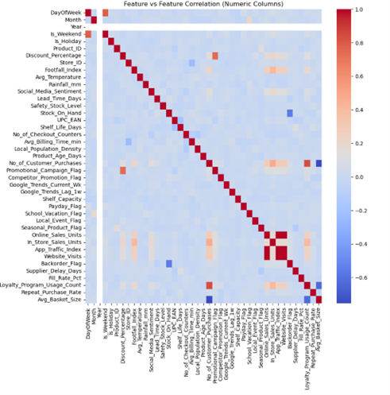
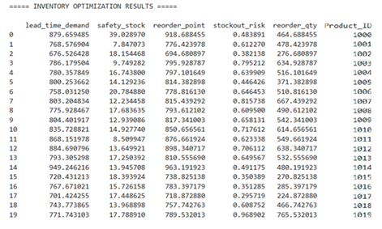
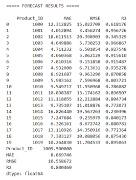
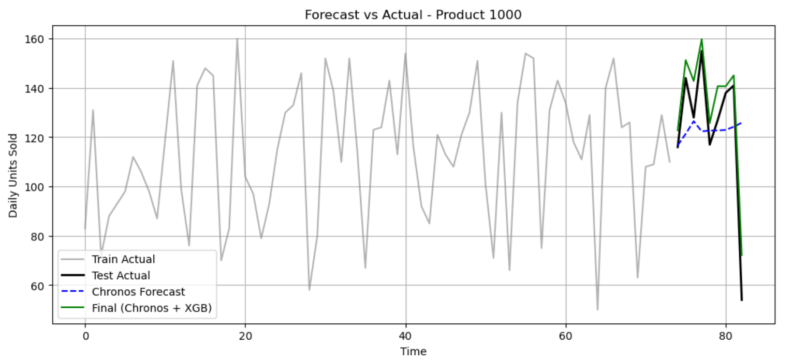

---

# 📦 Retail Demand Forecasting & Inventory Optimization

## 📌 Overview

Demand uncertainty in retail often leads to overstocking or stockouts. This project presents an end-to-end machine learning system to **forecast product demand** and support **inventory optimization**.

The solution combines machine learning, deep learning, and time-series forecasting to generate accurate **product-level predictions** and actionable inventory metrics.

---


---

## 🎯 Objectives

* Predict product demand using multiple modeling approaches
* Compare baseline, deep learning, and transformer-based models
* Incorporate time-series forecasting for improved accuracy
* Generate inventory planning metrics such as safety stock and reorder levels

---

## 🗂️ Dataset

* Retail dataset with product-level demand data
* Includes categorical, textual, and numerical features

### Preprocessing:

* Missing value handling
* Data cleaning and transformation
* Correlation and variance analysis
* Dimensionality reduction using PCA

---

## ⚙️ Methodology

### 🔍 1. Exploratory Data Analysis (EDA)

* Statistical analysis and data profiling
* Feature correlation analysis
* Missing value analysis

📊 Sample Insight:



---

### 🧠 2. Feature Engineering

* Categorical Encoding
* TF-IDF Vectorization
* Word2Vec Embeddings
* GloVe Embeddings
* PCA for dimensionality reduction

---

### 📊 3. Baseline Models

* Logistic Regression (Classification)
* Random Forest (Regression)

---

### 🤖 4. Advanced Models

#### Custom Deep Learning Model

* Designed a hybrid neural architecture
* Used for both classification and regression

#### Transformer-Based Models

* Classification: DistilBERT + XGBoost
* Time-Series Forecasting: Chronos + XGBoost

---

### 🚀 Key Innovation

* Adapted Chronos for **product-level demand forecasting**
* Combined time-series learning with gradient boosting
* Captured both:

  * Temporal patterns
  * Feature interactions

---

### 📦 5. Inventory Optimization

Based on forecasted demand:

* Safety Stock
* Lead Time Demand
* Reorder Quantity
* Stockout Risk

📊 Example Output:



---

### 🌐 6. Deployment

* Model inference integrated with a REST API using FastAPI (team collaboration)
* Supports real-time prediction

---

## 📊 Model Performance & Comparison

```text
Model                     | Task                  | Technique / Features        | Metric (R² / Accuracy)
--------------------------|----------------------|-----------------------------|----------------------
Logistic Regression       | Classification        | Categorical Encoding        | 0.94
Random Forest             | Regression            | TF-IDF Features             | 0.999
Custom Deep Learning      | Classification        | Categorical Encoding        | 0.91
Custom Deep Learning      | Regression            | TF-IDF Features             | 0.98
DistilBERT + XGBoost      | NLP Classification    | Transformer + Boosting      | 0.92
Chronos + XGBoost         | Time-Series Forecast  | Temporal + Tabular Hybrid   | 0.89
```

---

### 📈 Forecast Visualization (Key Result)




---

### 🧠 Key Insight

Traditional ML models performed strongly on structured features, while deep learning models provided stable performance. However, time-series forecasting using Chronos combined with XGBoost enabled capturing temporal demand patterns, making it more suitable for real-world inventory planning despite slightly lower R².

---

## 🏗️ Project Structure

```text
├── notebooks/
│   └── retail_demand_forecasting.ipynb
├── assets/
│   ├── eda/
│   ├── results/
│   ├── forecasts/
│   └── inventory/
├── reports/
│   └── retail_demand_forecasting_report.pdf
├── api/
│   └── main.py
├── requirements.txt
└── README.md
```

---

## 👤 My Contributions

* Designed and implemented custom deep learning model
* Developed Chronos + XGBoost forecasting pipeline
* Performed EDA, feature engineering, and model evaluation
* Led project documentation and presentation
* Collaborated on API integration using FastAPI

---

## 🛠️ Tech Stack

* Python
* Scikit-learn
* TensorFlow / PyTorch
* XGBoost
* NLP (TF-IDF, Word2Vec, GloVe)
* Transformers (DistilBERT, Chronos)
* FastAPI

---

## 🚀 FastAPI Features

- **REST API Endpoints**
  - Single & batch predictions
  - Feature extraction and transformation
  - Text embeddings
  - Model training
  - Data upload and processing
  - Statistics and analysis

- **Comprehensive Data Pipeline**
  - Data preprocessing and cleaning
  - Feature engineering
  - Model training and evaluation
  - Cross-validation support
  - Hyperparameter tuning
---
## 📋 Prerequisites

- Python 3.11.9
- pip (Python package manager)
- ~2GB disk space
- 4GB RAM minimum
---
## 📦 Installation

### Option 1: Automated Setup (Recommended)

#### Windows
Double-click the `start_api.bat` file or run:
```bash
start_api.bat
```

#### Linux/Mac
```bash
chmod +x start_api.sh
./start_api.sh
```

This will automatically:
- Create a virtual environment
- Install all dependencies from `requirements.txt`
- Create required directories (`models/`, `data/`, `logs/`)
- Start the API server

### Option 2: Manual Setup

1. **Clone/Download the repository and navigate to the project directory:**
```bash
cd my_api
```

2. **Create a virtual environment:**
```bash
# Windows
python -m venv venv
venv\Scripts\activate

# Linux/Mac
python3 -m venv venv
source venv/bin/activate
```

3. **Install dependencies:**
```bash
pip install -r requirements.txt
```

4. **Create required directories:**
```bash
mkdir models data logs
```
---
## 🚀 Running the API

### Using the Automated Script
```bash
# Windows
python run_server.py

# Or specify custom host/port
python run_server.py 127.0.0.1 8000 true
```

### Manual Start
```bash
# Activate virtual environment first
source venv/bin/activate  # Linux/Mac
# or
venv\Scripts\activate     # Windows

# Start the server
uvicorn app_advanced:app --host 0.0.0.0 --port 8000 --reload
```

The API will be available at: `http://127.0.0.1:8000`

Interactive API documentation:
- **Swagger UI:** `http://127.0.0.1:8000/docs`
- **ReDoc:** `http://127.0.0.1:8000/redoc`
- **OpenAPI JSON:** `http://127.0.0.1:8000/openapi.json`

---

## 📡 API Endpoints

### Health & Information
- **GET `/`** - Health check and API status
- **GET `/pipeline-info`** - Detailed pipeline configuration and capabilities
- **GET `/model-info`** - Current model status and configuration
- **GET `/feature-importance`** - Feature importance scores (if Random Forest trained)

### Predictions
- **POST `/predict`** - Make a single prediction with named features
- **POST `/batch-predict`** - Make multiple predictions at once

### Training
- **POST `/train-advanced`** - Advanced training with full ML pipeline (vectorization, PCA, multiple models)
- **POST `/clear-models`** - Clear all trained models and reset preprocessors (use when changing feature sets)

---

## 🧪 Testing the API

### Option 1: Interactive Testing
1. Open `http://127.0.0.1:8000/docs` in your browser
2. Click on any endpoint
3. Click "Try it out"
4. Fill in the parameters or use the examples above
5. Click "Execute"

### Option 2: Test Scripts
Run the provided test scripts in a new terminal:

```bash
# Activate virtual environment
source venv/bin/activate  # Linux/Mac
# or
venv\Scripts\activate     # Windows

# Run API prediction test
python test_api_prediction.py

# Run named features test
python test_named_features.py
```

### Option 3: Using Python Requests
```python
import requests

# Single prediction
url = "http://127.0.0.1:8000/predict"
data = {
  "prices": {"current_price": 50.0, "base_price": 45.0, ...},
  "sales": {"in_store_sales_units": 100, ...},
  # ... complete data
}

response = requests.post(url, json=data)
print(response.json())
```
---
## 🚨 Troubleshooting

### CUDA out of memory
- Set `device="cpu"` in config
- Reduce batch size
- Use a lighter model

### Model not found
- Ensure models are trained first
- Check model files in `models/` directory

### Feature dimension mismatch
- Verify feature count matches training data
- Use `/extract-features` endpoint to verify
---
## 📝 Logging

Logs are saved to `logs/api.log`. Enable detailed logging:
```python
import logging
logging.basicConfig(level=logging.DEBUG)
```
---
## 🔮 Future Improvements

* Full production deployment pipeline
* Real-time data ingestion
* Hyperparameter optimization
* Dashboard integration

---

## 📌 Conclusion

This project demonstrates how combining machine learning, deep learning, and time-series forecasting can solve real-world retail challenges and enable data-driven inventory planning.

---
## 🤝 Connect

- [LinkedIn](https://www.linkedin.com/in/varsha-shekhar)
- [Gmail](varshaiyer96@gmail.com)
